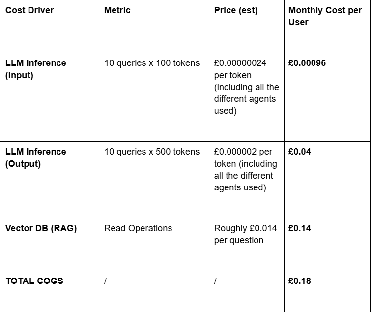

# Yichun - Math Exam Question Generator

**Date:** 15/01/2026
**Status:** Live
**Model Strategy:** Agentic Chatbot (Currently using Gemini Flash 2.5)

## Executive Summary

**Verdict:**
**Predicted Gross Profit:**
**Key Insight:**

## 1. The 'Unit' Definition

**Primary Unit:** We define the primary unit as one active student per month

**Average predicted usage:** In the school season, we would expect 2 sessions per week, at 1-2 prompts per session, so let's say 10 prompts per user per month.

## 2. COGS Breakdown

## 3. Revenue and Margin Analysis

it is currently free. :()

## 4. Sensitivity and Risk Analysis

All the risk since it's currently free. :()

## 5. Optimization

Charging for the service would help. TBD